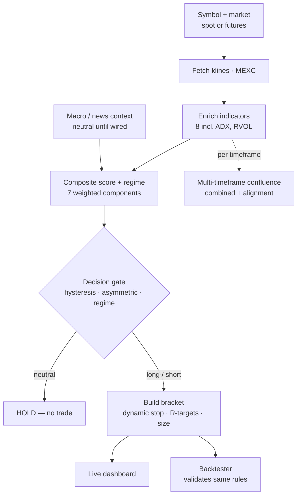

# market-analyzer

Market-analysis engine for trading gold tokens (**PAXG**, **XAUT**) and any
other pair on **MEXC**, across both **spot** and **futures**. It computes a
technical signal, blends it across timeframes, suggests a risk-defined entry
bracket, and validates the same logic with a backtester.

- **market-analyzer-api** — FastAPI backend (this repo)
- **market-analyzer-dashboard** — React + TypeScript frontend (separate repo)

> **Analysis & alerts only — no order placement anywhere in the codebase.**
> Not financial advice; every signal is a probabilistic edge at best, and the
> entry/stop/target levels are risk management, not predictions.

---

## Flow



One spine, a single branch (trade vs. hold), one fork (live vs. backtest).
Every failure mode — bad symbol, missing ATR, weak signal, choppy market — is a
place where the flow **stops or holds** rather than forcing a trade through.

---

## Architecture

```
   MEXC spot  ──► market_data.py ─┐
   MEXC futures ► futures_data.py ┤  (+ Binance, for the price cross-check)
                                  ▼
                            indicators.py   EMA · RSI · MACD · Bollinger · ATR
                                            Supertrend · ADX · RVOL
                                  │
                  ┌───────────────┼───────────────┐
                  ▼               ▼                ▼
            patterns.py    signal_engine.py   context_providers.py
          candlestick      weighted blend →   macro (DXY/premium)
          patterns         score [-100..100]  news (Claude-scored)
                                  │
                                  ▼
                            strategy.py   StrategyConfig + decide()
                          (hysteresis · asymmetric · regime — shared by both)
                                  │
                  ┌───────────────┼───────────────┐
                  ▼               ▼                ▼
             entries.py       backtest.py       mtf.py
        entry/stop/target  walk-forward,     multi-timeframe
        /size bracket      real bracket      confluence
                  └───────────────┬───────────────┘
                                  ▼
                              api.py  (FastAPI) · main.py (deploy entry)
       /candles /analyze /analyze_mtf /entry /backtest /symbols /sanity
```

| Module | Responsibility |
|---|---|
| `market_data.py` | MEXC **spot** client (+ Binance for cross-check). Env `MARKET_BASE_URL`. |
| `futures_data.py` | MEXC **futures** (contract) client. Env `FUTURES_BASE_URL`. |
| `indicators.py` | `enrich()` — attaches all 8 indicators. |
| `patterns.py` | Candlestick pattern detection. |
| `signal_engine.py` | `analyze()` — blends components into the composite score. |
| `strategy.py` | **`StrategyConfig` + `decide()`** — shared trade logic. |
| `entries.py` | `suggest()` — entry/stop/target/size bracket. |
| `backtest.py` | `run()` — event-driven backtest of the real bracket. |
| `mtf.py` | `analyze_mtf()` — multi-timeframe confluence. |
| `context_providers.py` | Macro + news (Claude-scored) feeds. |
| `api.py` | FastAPI endpoints. |
| `main.py` | Entry point for deployment (binds `$PORT`). |

---

## Run

```bash
pip install -r requirements.txt
uvicorn api:app --reload --port 8000     # or: python main.py
# open http://localhost:8000/docs
```

Deploy to Render: see **`DEPLOY.md`** (use a non-US region — MEXC and Binance
geo-restrict US IPs).

---

## Indicators (`indicators.enrich`)

| Indicator | Params | Measures |
|---|---|---|
| EMA fast / slow | 21 / 55 | Trend direction |
| RSI | 14 (Wilder) | Momentum |
| MACD | 12 / 26 / 9 | Momentum acceleration |
| Bollinger Bands | 20, 2σ (population) | Volatility / mean-reversion |
| ATR | 14 (Wilder) | Volatility → stop distance & sizing |
| Supertrend | 10, ×3 | Trend confirmation |
| ADX | 14 | **Trend strength → regime** |
| RVOL | 20 | **Relative volume → dynamic stop** |

TradingView-faithful math (Wilder RMA, population stdev, recursive EMA).

---

## The signal (`signal_engine.analyze`)

Each component emits a signed sub-score in `[-1, 1]`; the weighted blend scales
to `[-100, 100]`.

| Component | Weight | Source |
|---|:---:|---|
| trend | 0.30 | EMA21 vs EMA55, price vs slow EMA |
| momentum | 0.25 | RSI(14) centered, MACD histogram |
| volatility | 0.10 | position within Bollinger band |
| supertrend | 0.10 | ATR Supertrend direction |
| candles | 0.10 | engulfing / hammer / star patterns |
| macro | 0.10 | DXY + PAXG-vs-spot premium *(neutral until wired)* |
| news | 0.05 | Claude-scored headline sentiment *(neutral until wired)* |

**Label:** `≥40` Strong Bullish · `≥15` Bullish · `−15…+15` Neutral · `≤−40`
Strong Bearish. **Confidence** = component agreement.

---

## Decision & bracket

The score passes through a two-gate decision (`strategy.decide`):

- **Hysteresis** — enter long at `+15`, hold until the score falls below `+5`.
- **Asymmetric** — longs at `+15`, shorts at `−25` (shorts need more confluence).
- **Regime** — ADX < 20 ⇒ ranging ⇒ entry threshold ×1.6 (don't buy the top in chop).
- **Hard ATR guardrail** — no ATR ⇒ no trade.

A valid long/short builds the bracket (`entries.suggest`): entry = close,
stop = `k×ATR` (`1.5`, or `2.5` on an RVOL spike), targets at `1R/2R/3R`, and a
position size from your account + risk % so the dollar risk is fixed. Tuning
knobs live in `strategy.StrategyConfig` — defaults are starting points, not
optimized values.

---

## Multi-timeframe confluence (`mtf.analyze_mtf`)

Scores the signal on **15m / 1h / 4h / 1d** and combines them, weighting higher
timeframes more (1d 0.35, 4h 0.30, 1h 0.25, 15m 0.15). Returns a per-timeframe
breakdown, a combined score, and an **alignment %** — the real conviction
metric. High alignment means the timeframes agree; low alignment means they
conflict (low-conviction setup). One `/analyze_mtf` request fans out to the four
timeframes server-side.

---

## API

Base `http://localhost:8000` · docs at `/docs`. Common params: `symbol`,
`interval`, `market` (`spot`|`futures`).

| Endpoint | Purpose |
|---|---|
| `GET /candles` | OHLCV + indicators for charting |
| `GET /analyze` | Composite signal (single timeframe) |
| `GET /analyze_mtf` | Multi-timeframe confluence (combined + alignment) |
| `GET /entry` | Entry/stop/target bracket + sizing (`account`, `risk_pct`) |
| `GET /backtest` | Walk-forward backtest metrics + equity curve |
| `GET /symbols` | Full tradable catalog (autocomplete) |
| `GET /sanity` | Price cross-check vs Binance |
| `GET /health` | Liveness |

---

## Dashboard

Futures/spot toggle (**defaults to futures**), symbol autocomplete, a timeframe
selector (**5m / 15m / 1h / 4h / 1d / ALL** — `ALL` surfaces the multi-timeframe
panel at the top), the bias gauge, the entry panel (sizing + regime chip), the
backtest panel, the Binance cross-check toggle, and a **mobile-responsive**
layout. The default API URL comes from `VITE_API_BASE`.

---

## Where to extend (seams already cut)

- **Macro** — fill in `context_providers.macro_context`: a DXY feed and a spot
  XAU/USD feed for the PAXG premium (highest-value for gold).
- **News** — `context_providers.news_context(headlines)` scores headlines with
  Claude; set `ANTHROPIC_API_KEY` and feed it a headline source.
- **Live mode** — a MEXC WebSocket kline stream calling `signal_engine.analyze`
  on each closed bar, pushed to the dashboard over SSE/WS.
- **Alerts** — fire Telegram/email when `analyze().score` crosses a threshold.
- **MTF veto** — optionally block a trade when the top timeframe disagrees
  (currently the conflict is surfaced via alignment, not hard-blocked).
- **Trade execution** — deliberately absent; keep it behind a separate,
  explicitly-keyed module if ever added.

---

## Honest limits

Every layer is a probabilistic edge at best. Default weights/thresholds are
**un-optimized** — validate per pair in the backtester. The regime filter is
conservative (raises the bar in a range rather than trading the range). TA on
thin MEXC alts is noisy — use the Binance cross-check to gauge data quality.
Backtests overstate live results (no slippage, single asset, in-sample risk).
This structures your decisions; it does not replace judgment.