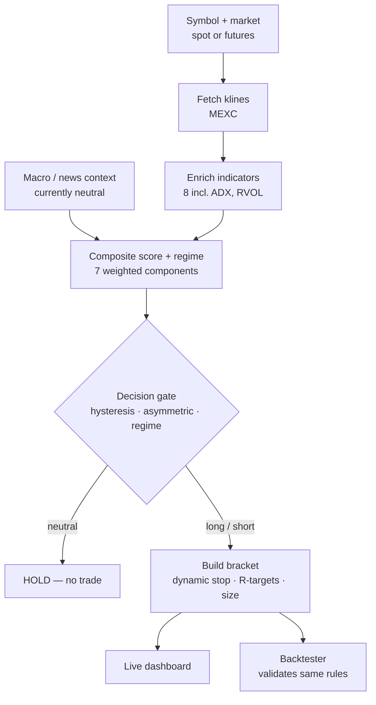
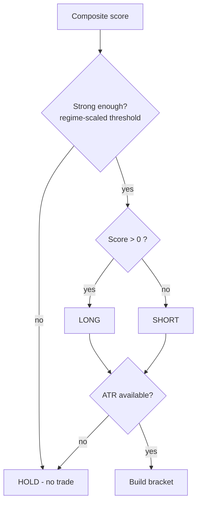

# Gold / Crypto Market Analyzer — Documentation

A market-analysis tool for trading gold tokens (PAXG, XAUT) and any other pair
on **MEXC**, across both **spot** and **futures**. It computes a technical
signal, suggests a risk-defined entry bracket, and validates the same logic
with a backtester. **Analysis & alerts only — it never places orders.**

> Not financial advice. Every signal is a probabilistic edge at best; the
> entry/stop/target levels are risk management, not predictions.

---

## 1. What it does (in one breath)

Pick a symbol and market → it pulls candles from MEXC → computes 8 indicators →
blends them into a single **bias score (−100…+100)** → a decision gate turns
that score into **long / short / hold** → if it's a trade, it builds an
**entry + stop + targets + position size** → the same rules are replayed over
history by the **backtester**.

---

## 2. End-to-end workflow



The shape matters: it's one spine with a single branch (trade vs. hold) and one
fork at the end (live vs. backtest). Every failure mode — bad symbol, missing
ATR, weak signal, choppy market — is a place where the flow **stops or holds**
rather than forcing a trade through.

---

## 3. Architecture

**Backend** — Python + FastAPI (flat modules in `Backend/`).
**Frontend** — React + TypeScript (Vite), charts via `recharts`.

| Module | Responsibility |
|---|---|
| `market_data.py` | MEXC **spot** client (+ Binance for cross-check). Switch base via `MARKET_BASE_URL`. |
| `futures_data.py` | MEXC **futures** (contract) client. Switch base via `FUTURES_BASE_URL`. |
| `indicators.py` | `enrich()` — attaches all 8 indicators to the candle frame. |
| `patterns.py` | Candlestick pattern detection. |
| `signal_engine.py` | `analyze()` — blends components into the composite score. |
| `strategy.py` | **`StrategyConfig` + `decide()`** — the shared trade logic (hysteresis, asymmetry, regime). |
| `entries.py` | `suggest()` — builds the entry/stop/target/size bracket. |
| `backtest.py` | `run()` — event-driven backtest of the real bracket. |
| `context_providers.py` | Macro (DXY/premium) + news (Claude-scored) feeds. |
| `api.py` | FastAPI endpoints. |

> `strategy.py` is the key design choice: live trading and backtesting both read
> from one config, so they can never silently diverge.

---

## 4. Indicators (`indicators.enrich`)

| Indicator | Params | Measures |
|---|---|---|
| EMA fast / slow | 21 / 55 | Trend direction |
| RSI | 14 (Wilder) | Momentum, overbought/oversold |
| MACD | 12 / 26 / 9 | Momentum acceleration |
| Bollinger Bands | 20, 2σ (population) | Volatility / mean-reversion |
| ATR | 14 (Wilder) | Volatility → stop distance & sizing |
| Supertrend | 10, ×3 | Trend confirmation |
| ADX | 14 | **Trend strength → regime** (trend vs range) |
| RVOL | 20 | **Relative volume → dynamic stop** |

All math is TradingView-faithful (Wilder RMA for RSI/ATR/ADX, population stdev
for Bollinger, recursive EMA).

---

## 5. The signal score (`signal_engine.analyze`)

Each component emits a signed sub-score in `[-1, +1]`; the weighted blend is
scaled to `[-100, +100]`.

| Component | Weight | Source |
|---|---:|---|
| Trend | 0.30 | EMA21 vs EMA55, price vs slow EMA |
| Momentum | 0.25 | RSI centered + MACD histogram |
| Volatility | 0.10 | Position within Bollinger band (mean-reversion) |
| Supertrend | 0.10 | ATR Supertrend direction |
| Candles | 0.10 | Engulfing / hammer / star patterns |
| Macro | 0.10 | DXY + PAXG-vs-spot premium *(neutral until wired)* |
| News | 0.05 | Claude-scored headline sentiment *(neutral until wired)* |

**Label:** `≥40` Strong Bullish · `≥15` Bullish · `−15…+15` Neutral · `≤−40`
Strong Bearish (Bearish between). **Confidence** = component agreement (high when
they point the same way, low when they conflict).

---

## 6. Decision logic (`strategy.decide`)



Three rules stack on the gate:

- **Hysteresis** — enter long at `+15`, but don't drop to HOLD until the score
  falls below `+5`. Stops the system from flip-flopping on border noise.
- **Asymmetric thresholds** — longs at `+15`, shorts at `−25` (shorts demand
  more confluence). Configurable, not hardcoded.
- **Regime gate** — when ADX < 20 the market is "ranging" and the entry
  threshold is raised ×1.6 (≈ 24), so it won't buy a local top in chop.
- **Hard ATR guardrail** — no ATR ⇒ no trade (a direction without an
  invalidation price is forbidden).

---

## 7. Entry bracket (`entries.suggest`)

For a valid long/short:

- **Entry** = current close.
- **Stop** = `entry ∓ k × ATR`, where `k = 1.5` normally, **`2.5` when RVOL
  spikes** (high volume → wider stop).
- **Targets** = `1R / 2R / 3R` ladder (R = the stop distance).
- **Position size** = `(account × risk%) ÷ stop_distance`. Widening the stop
  auto-shrinks the position, so the dollar risk stays identical.
- Output also includes `regime`, `adx`, the `atr_mult` actually used, and
  implied leverage.

---

## 8. Backtester (`backtest.run`)

Replays the **exact live rules** over history (no longer a separate strategy):

- Entries via the same `decide()` (hysteresis / asymmetric / regime).
- On entry: real ATR stop + `target_R` target.
- Each later bar: exit if the bar's range hits the stop or target (stop checked
  first — conservative), else exit on a signal flip.
- No look-ahead: the score at bar *i* uses data ≤ *i*; the fill is at that bar's
  close; stop/target only checked on later bars.
- Reports: total return, buy-and-hold, win rate, trade count, max drawdown,
  Sharpe, and the equity curve.

---

## 9. API endpoints

Base: `http://localhost:8000` · interactive docs at `/docs`.

| Endpoint | Purpose |
|---|---|
| `GET /candles` | OHLCV + indicators for charting |
| `GET /analyze` | Current composite signal |
| `GET /entry` | Entry/stop/target bracket + sizing |
| `GET /backtest` | Walk-forward backtest metrics + equity curve |
| `GET /symbols` | Full tradable catalog (autocomplete) |
| `GET /sanity` | Price cross-check vs Binance |
| `GET /health` | Liveness |

Common query params: `symbol`, `interval`, `market` (`spot`\|`futures`).
`/entry` adds `account`, `risk_pct`. `/backtest` adds `enter_long`,
`enter_short`, `allow_short`, `target_r`, `fee_bps`.

---

## 10. Tuning knobs (`strategy.StrategyConfig`)

| Field | Default | Meaning |
|---|---:|---|
| `enter_long` | `15` | Score to open a long |
| `enter_short` | `−25` | Score to open a short (asymmetric) |
| `exit_long` / `exit_short` | `5` / `−5` | Hysteresis exit levels |
| `allow_short` | `True` | Permit short entries |
| `atr_mult` | `1.5` | Base stop multiple |
| `atr_mult_highvol` | `2.5` | Wide stop on volume spike |
| `rvol_high` | `2.0` | RVOL that triggers the wide stop |
| `regime_adx_min` | `20` | ADX below ⇒ ranging |
| `range_threshold_mult` | `1.6` | Threshold multiplier in a range |
| `target_R` | `2.0` | Backtest exit target (R) |

> These are **reasonable starting points, not optimized values.** Tune them per
> pair using the backtester.

---

## 11. Frontend (`src/`)

| Area | Files |
|---|---|
| Core | `types.ts`, `theme.ts`, `lib/format.ts`, `lib/demo.ts` |
| Data | `api/client.ts` (typed fetch layer) |
| Components | `Header`, `BiasGauge`, `SignalComponents`, `PriceChart`, `Patterns`, `ContextNotes`, `LiveView`, `SymbolPicker`, `EntryPanel`, `BacktestPanel`, `Stat` |
| Shell | `App.tsx`, `main.tsx` |

Features: spot/futures toggle, symbol autocomplete from the live catalog,
Live/Research mode, the bias gauge, the entry panel (with sizing inputs and the
regime chip), and the Binance cross-check toggle.

---

## 12. Run it

**Backend**
```bash
pip install -r requirements.txt
uvicorn api:app --reload --port 8000
# open http://localhost:8000/docs
```

**Frontend**
```bash
npm create vite@latest gold-dashboard -- --template react-ts
cd gold-dashboard && npm install && npm install recharts
# drop the src/ files in, then:
npm run dev   # http://localhost:5173
```

Source switching (env vars):
`MARKET_BASE_URL` (spot, default `https://api.mexc.com`),
`FUTURES_BASE_URL` (futures, default `https://contract.mexc.com`).

---

## 13. Known limitations

- Macro and news feeds are **stubbed/neutral** until you wire DXY, the
  PAXG-vs-spot premium, and a headline source.
- Default config values are **un-optimized** — validate per pair.
- The regime filter is conservative (it *raises the bar* in a range rather than
  switching to a mean-reversion strategy).
- TA on thin/low-liquidity MEXC alts is noisy — the signal is only as good as
  the candles. Use the Binance cross-check to gauge data quality.
- Backtests overstate live results (no slippage model, single asset,
  in-sample tuning risk).